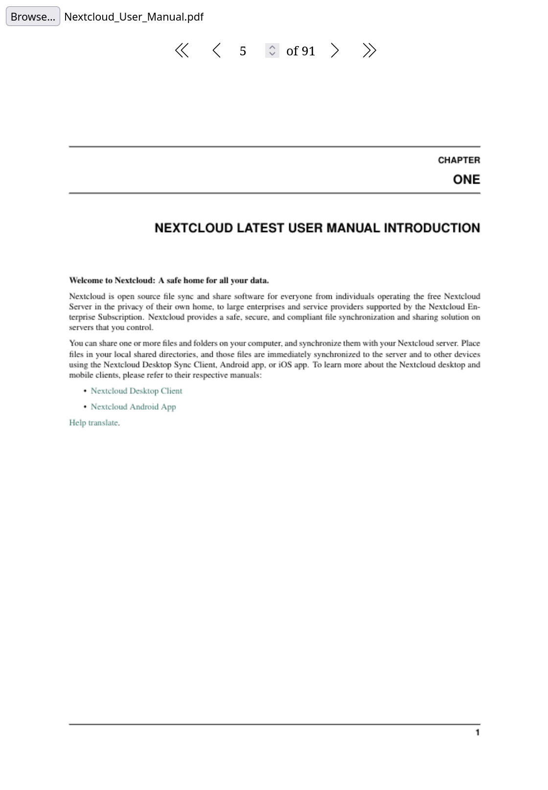

# PdfViewer Web Component

[GitHub](https://github.com/digital-blueprint/toolkit/tree/main/packages/pdf-viewer) |
[NPM](https://www.npmjs.com/package/@dbp-toolkit/pdf-viewer)

This component is a wrapper around the [pdf.js](https://mozilla.github.io/pdf.js/)
library to display PDF files in the browser.

You can install this component via npm:

```bash
npm i @dbp-toolkit/pdf-viewer
```

## Usage

```html
<dbp-pdf-viewer></dbp-pdf-viewer>
<script type="module" src="node_modules/@dbp-toolkit/pdf-viewer/dist/dbp-pdf-viewer.js"></script>
```

Or directly via CDN:

```html
<dbp-pdf-viewer></dbp-pdf-viewer>
<script type="module" src="https://unpkg.com/@dbp-toolkit/pdf-viewer@0.0.6/dist/dbp-pdf-viewer.js"></script>
```

## Attributes

- `lang` (optional, default: `de`): set to `de` or `en` for German or English
    - example `<dbp-pdf-viewer lang="de" client-id="my-client-id"></dbp-pdf-viewer>`
- `auto-resize` (optional, default: `cover`)
    - set to `contain` to resize the viewed PDF to fit the container horizontally and vertically
    - set to `cover` to resize the viewed PDF to fit the container horizontally only,
      vertically the PDF can exceed the container
    - example `<dbp-pdf-viewer auto-resize="contain"></dbp-pdf-viewer>`

## Methods

- `showPDF(file: File)`: Opens a PDF file. The file must be a `File` object.
    - example `document.querySelector('dbp-pdf-viewer').showPDF(file);`

## Screenshot



## Opening a PDF file

You can use the `showPDF` method to open a PDF file. This method accepts a `File` object as parameter.

```html
<input @change=${this.openFile} type="file" />
<dbp-pdf-viewer lang="en"></dbp-pdf-viewer>
<script type="module" src="https://unpkg.com/@dbp-toolkit/pdf-viewer@0.0.6/dist/dbp-pdf-viewer.js"></script>

<script>
  document.querySelector('input').addEventListener('change', function(e) {
    if (e.target.files[0]) {
      let file = e.target.files[0];

      console.log('You selected ' + file.name);
      document.querySelector('dbp-pdf-viewer').showPDF(file);
    }
  });
</script>
```

See [example/index.html](example/index.html) for a working example.

## Local development

```bash
# get the source
git clone git@github.com:digital-blueprint/toolkit.git
cd toolkit/packages/pdf-viewer

# install dependencies
npm install

# constantly build dist/bundle.js and run a local web-server on port 8002 
npm run watch

# run tests
npm test

# build local packages in dist directory
npm run build
```

Jump to <http://localhost:8002> and you should get a demo page.
