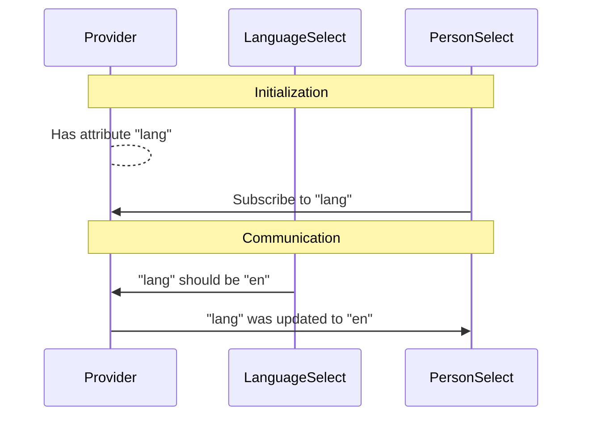
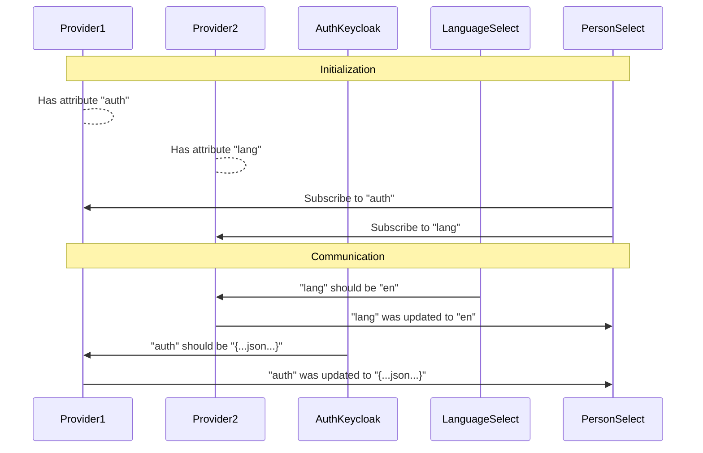

# Provider Web Components

[GitLab Repository](https://github.com/digital-blueprint/toolkit)

You can install this component via npm:

```bash
npm i @dbp-toolkit/provider
```

## Local development

```bash
# get the source
git clone git@github.com:digital-blueprint/toolkit.git
cd toolkit/packages/provider

# install dependencies (make sure you have npm version 4+ installed, so symlinks to the git submodules are created automatically)
npm install

# constantly build dist/bundle.js and run a local web-server on port 8002 
npm run watch

# run tests
npm test
```

Jump to <http://localhost:8002> and you should get a demo page.

## Provider

### Usage

You can provide attributes (e.g. `global-name`) for components inside the provider:

```html
<dbp-provider global-name="value" global-name2="value2">
  <dbp-person-select subscribe="local-name:global-name"></dbp-person-select>
  <dbp-person-profile subscribe="local-name:global-name,local-name2:global-name2"></dbp-person-profile>
</dbp-provider>
<script type="module" src="node_modules/@dbp-toolkit/provider/dist/dbp-provider.js"></script>
```

Or you can also use the CDN to include the component:

```html
<script type="module" src="https://unpkg.com/@dbp-toolkit/provider@0.2.2/dist/dbp-provider.js"></script>
```

All other components are also inherent providers (see below), so you don't really need `dbp-provider` in the shadow dom
of other components. The use of `dbp-provider` is mainly suggested being used for namespacing (e.g. different languages
or entry point urls on the same page) or to deliver attribute changes across different components.

### Examples

#### Example 1 - Simple communication

```html
<dbp-provider lang>
  <dbp-language-select></dbp-language-select>
  <!-- 'subscribe="lang"' is short for 'subscribe="lang:lang"' --> 
  <dbp-person-select subscribe="lang"></dbp-person-select>
</dbp-provider>
```

There is a provider around a language selector and a person selector.
The flow looks like this:



##### Flow

1) The language selector propagates a change of `lang` (because the user clicked on it)
2) The provider receives that event, because it has the attribute `lang` set
3) The provider executes a callback with the updated value for `lang` in all components that subscribed `lang`

#### Example 2 - Two providers

```html
<!--  Provider1 -->
<dbp-provider auth>
  <!--  Provider2 -->
  <dbp-provider lang>
    <dbp-auth-keycloak></dbp-auth-keycloak>
    <dbp-language-select></dbp-language-select>
    <dbp-person-select subscribe="auth,lang"></dbp-person-select>
  </dbp-provider>
</dbp-provider>
```

There are two cascaded providers around an auth component, a language selector and a person selector.
The flow looks like this:



##### Flow

1) The language selector propagates a change of `lang` (because the user clicked on it)
2) The provider 2 receives that event, because it has the attribute `lang` set
3) The provider 2 executes a callback with the updated value for `lang` in all components that subscribed `lang`
4) The auth component propagates a change of `auth` (because a new token was issued by Keycloak)
5) The provider 1 receives that event, because it has the attribute `auth` set
6) The provider 1 executes a callback with the updated value for `auth` in all components that subscribed `auth`

### Attributes

- `init` (optional): set your vars to values
  - example `<dbp-provider init="foo=bar"></dbp-provider>`
- `id` (optional): set an id, useful for debugging
  - example `<dbp-provider id="p-1"></dbp-provider>`

## AdapterLitElement

This is a class you can derive your component class from instead of `LitElement`.

You can locally "subscribe" to attributes (e.g. `local-name`) that can be provided by a `dbp-provider` (e.g. `global-name`).
You need to make this available attributes as LitElement properties.

### Example

Multiple attributes can be subscribed when separated by a comma (`,`).

```html
<dbp-person-select subscribe="local-name:global-name,local-name2:global-name2"></dbp-person-select>
```

If `local-name` and `global-name` are the same you could also instead of `local-name:local-name` just write `local-name`:

```html
<dbp-person-select subscribe="local-name"></dbp-person-select>
```

### Inherent provider

AdapterLitElement are themselves provider that will provide all their own attributes to all the elements in their shadow dom.

In this example `dbp-auth-keycloak` would use the `set-property` event to propagate an `auth` property.
`dbp-person-select-demo` would act as provider for `auth`. `dbp-person-select` would subscribe to `auth` to receive
the bearer token via `this.auth.token`.

```html
<dbp-person-select-demo auth lang="de" entry-point-url="http://127.0.0.1:8000">
  <!-- #shadow-root -->
  <dbp-auth-keycloak></dbp-auth-keycloak>
  <dbp-person-select subscribe="auth" lang="${this.lang}" entry-point-url="${this.entryPointUrl}"></dbp-person-select>
</dbp-person-select-demo>
```

## AdapterElement

This is a wrapper for third party webcomponents. you can wrap this class around to support the provider functionality in third party webcomponents.

You can locally "subscribe" to attributes (e.g. `local-name`) that can be provided by a `dbp-provider` (e.g. `global-name`). The `dbp-adapter` will set the attributes to his childnodes.

### Example

Multiple attributes can be subscribed when separated by a comma (`,`).

```html
<dbp-provider global-name="value" global-name2="value2">
  <dbp-provider-adapter subscribe="local-name:global-name">
    <third-party-webcomponent>  </third-party-webcomponent>
  </dbp-provider-adapter>
</dbp-provider>
<script type="module" src="node_modules/@dbp-toolkit/provider/dist/dbp-provider.js"></script>
<script type="module" src="node_modules/@dbp-toolkit/provider/dist/dbp-adapter.js"></script>
```